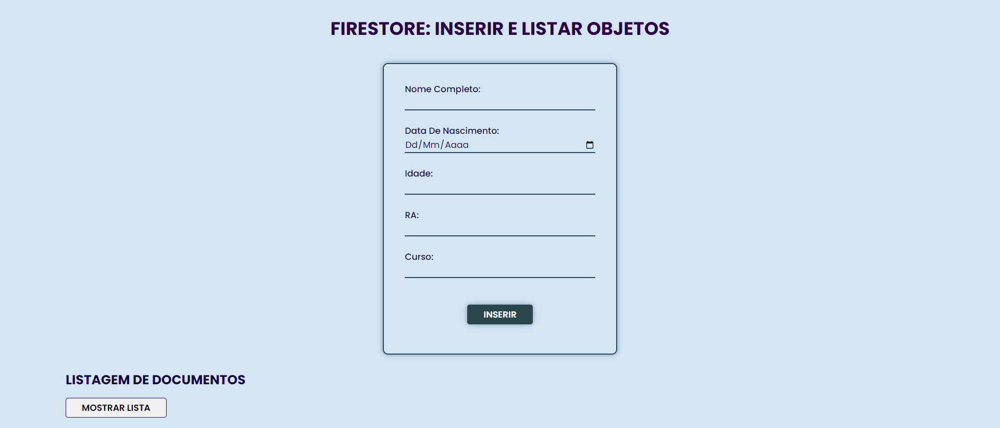

# Firestore Features

Este é um projeto simples que demonstra como inserir e listar objetos usando o Firestore, um banco de dados NoSQL em tempo real fornecido pelo Firebase. Este projeto é escrito em HTML, CSS e JavaScript e requer a configuração do Firebase para funcionar corretamente.

